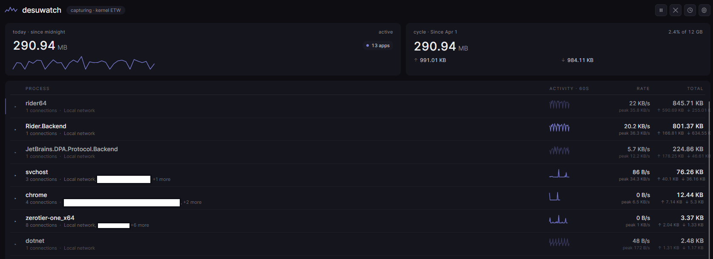
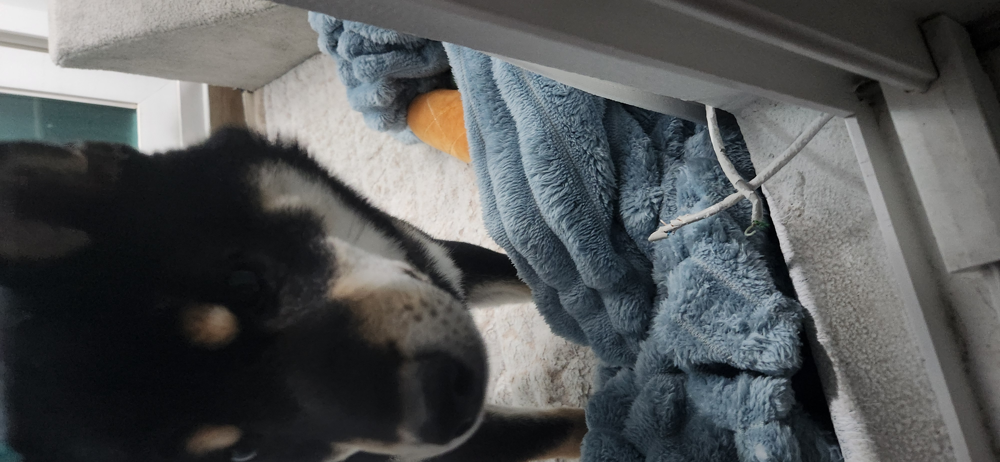
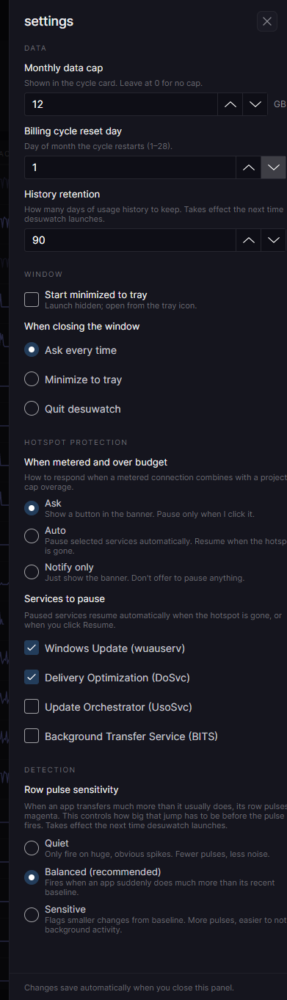
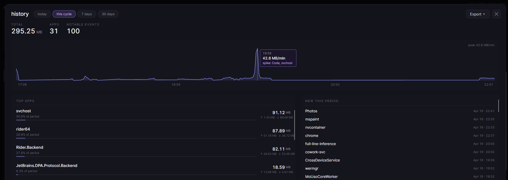

# dubuwatch

**A hotspot-smart, per-app network monitor for Windows.**
Built because the existing options are either ugly, shallow, paid, or enterprise-only.

<p align="center">
  
</p>

---

## Install (30 seconds)

1. Grab the latest release from the [Releases page](https://github.com/desuqcafe/dubuwatch/releases) - single `.exe`, no installer.
2. Right-click → **Run as administrator**. (dubuwatch reads byte counts from the Windows kernel; this requires elevation. More on that in [Privacy](#privacy--what-this-app-does).)
3. That's it. The app starts capturing immediately.

If you'd rather build from source, see [Building](#building-from-source) further down.

> **Requirements:** Windows 10 build 19041+ or Windows 11. .NET 8 runtime ships with the release build.

---

## Why I built this

My puppy Dubu chewed through my ethernet cable.

I spent the next day tethered to my phone's hotspot, watching my data cap evaporate because I had no real-time visibility into which apps were quietly burning through it. Windows' built-in "Data usage" page is a historical summary, not a live view. The third-party options all had something wrong with them:

- **GlassWire** is pretty but shallow - no proactive hotspot handling, paid tier for basic features.
- **NetLimiter** is powerful but has a UI from 2008.
- **Little Snitch** is Mac-only.
- **Portmaster** is a firewall trying to be a monitor.
- **Datadog / enterprise tools** - overkill and not built for personal machines.

There was a real gap: *a beautiful, hotspot-aware, per-app network monitor on Windows that treats your data cap as a first-class concern.* dubuwatch is my attempt at filling it.

<p align="center">
  
  <br>
  <em>Dubu, the project's unofficial co-founder.</em>
</p>

---

## Features

### Live per-app capture with host breakdown
Every app's real-time bytes-per-second, total session bytes, and a 60-second sparkline. Click any app to expand - see the actual remote domains it's talking to (`googlevideo.com`, `discord.com`, etc.), with separate send/receive counts per host. Private IPs collapse into a single "Local network" row so your LAN chatter doesn't spam the list.

Reverse DNS runs async with a 3-second timeout and a persistent 30-day cache, so hostnames appear within a second or two of first traffic and stick around across restarts.

### Hotspot-aware with escalation
dubuwatch uses Windows' `NetworkInformation` API to detect metered connections - not adapter-name heuristics or SSID lists, so it respects your manual overrides. When you're on a hotspot, the header banner turns amber. If you're roaming, over your data limit, or approaching it, the banner escalates to magenta.

### Predictive budget warnings
Set your monthly data cap (e.g. 20 GB) and a billing cycle reset day. dubuwatch runs a rolling 24-hour rate projection and tells you the ETA for hitting your cap in plain language:

> *Metered (AT&T) - projected to exceed 20 GB cap Thu*

Severity tiers at 85% / 100% / 125% of cap. The banner merges cost and budget into one line - no stacking, no noise.

### Proactive hotspot protection
When you're on a metered connection, dubuwatch can automatically pause the services that are notorious for burning hotspot data in the background:

- Windows Update (`wuauserv`)
- Delivery Optimization (`DoSvc`)
- Update Orchestrator (`UsoSvc`, optional)
- Background Intelligent Transfer (`BITS`, optional)

Three modes: **Ask** (default - shows a button in the banner), **Auto** (intervenes silently but visibly - status pill always reflects what's paused), or **Notify-only** (just tell me, don't touch my services). Services auto-resume the moment you leave the hotspot. If dubuwatch crashes while services are paused, they get force-resumed on next launch - no silently-disabled Windows Update.

The allowlist is curated, not free-form. No typing service names into a text field; no way to accidentally disable printing.

<p align="center">
  
</p>

### History & export
Ninety days of per-minute history, queryable by range (today / this cycle / 7 days / 30 days). Purple-gradient timeseries chart, top-apps ranking with share-of-period bars, anomaly history, and a "new this period" section surfacing apps that first appeared in the selected window.

Export to CSV or JSON, scoped to whatever range you're viewing. Self-describing files include range + export timestamp metadata so they stay useful if you detach them from context.

<p align="center">
  
</p>

### Per-app anomaly pulse
Each app (and each host within it) maintains a 60-second rolling baseline. When throughput exceeds `mean + 2.5σ` AND crosses a 50 KB/s floor, the row pulses muted magenta and the sparkline shifts light purple. It's a 550ms transition, not a flash - you'll catch it from the corner of your eye, but it won't strobe.

Three sensitivity presets (Quiet / Balanced / Sensitive) in settings.

### System tray integration
Close the main window - dubuwatch keeps running in the tray with a live-throughput tooltip. First close prompts for your preferred behavior (Minimize / Quit / Cancel) with a "Don't ask again" checkbox. Optional start-minimized mode for autostart use.

### Pause / Resume / Clear
Pause fully stops the ETW capture session - zero overhead while paused, honestly represented as a gap in sparklines rather than a fake zero. Resume re-initializes cleanly. Clear resets session counters without touching the history database, so your "Today" / "This cycle" totals stay accurate.

---

## Privacy & what this app does

dubuwatch requires administrator elevation. You should understand why before running any admin tool.

**What dubuwatch does:**
- Opens a kernel ETW (Event Tracing for Windows) session named `desuwatch-kernel-session`.
- Subscribes to the `Microsoft-Windows-Kernel-Network` provider to observe TCP/IP send/receive events.
- Reads `(process_id, local_port, remote_address, byte_count)` for each event.
- Resolves remote IPs to hostnames via the system DNS resolver.
- Aggregates these into per-minute rollups and stores them locally in SQLite.

**What dubuwatch does not do:**
- No packet capture. dubuwatch never sees the contents of your traffic, only byte counts and IP endpoints.
- No network interception, firewalling, or packet filtering. dubuwatch observes traffic through kernel ETW; it does not sit in the network path.
- No telemetry. No analytics. No phone-home. No network calls outside of the DNS lookups for reverse-resolving IPs you're already connecting to.
- No account. No login. No sync. Everything is local.

**What dubuwatch can modify** (opt-in, user-controlled):
- **Windows services**, if Hotspot Protection is enabled. In "Ask" or "Auto" mode, dubuwatch can pause specific services (Windows Update, Delivery Optimization, and optionally Update Orchestrator / BITS) while you're on a metered connection, and resume them automatically when you leave. The allowlist is curated - dubuwatch will never pause a service that isn't in its built-in list, and you can disable this feature entirely by setting Hotspot Protection to "Notify only."

**Where your data lives:**
- `%LOCALAPPDATA%\desuwatch\history.db` - per-minute rollups, 90-day retention (configurable).
- `%LOCALAPPDATA%\desuwatch\dns-cache.db` - resolved hostnames, 30-day retention.
- `%LOCALAPPDATA%\desuwatch\settings.json` - your preferences.

Delete the folder to fully reset the app. That's it.

**Why admin?** Kernel ETW sessions require elevation on Windows - there's no unprivileged path to per-process byte attribution at the kernel level. Some alternative tools avoid this by using netstat-polling or WFP filter drivers; dubuwatch uses ETW because it's read-only and has the smallest surface area.

The service-pause feature (Windows Update, etc.) also requires admin because `System.ServiceProcess.ServiceController` needs it. If you don't want service control, set Hotspot Protection mode to **Notify-only** in settings - the detection still works, but dubuwatch won't touch any services.

---

## Architecture

Three projects, strict dependency direction:

```
desuwatch.App  ──►  desuwatch.Capture  ──►  desuwatch.Storage
     │                                          ▲
     └──────────────────────────────────────────┘
```

- **`desuwatch.Capture`** (`net8.0-windows`) - kernel ETW engine, DNS resolver, connection cost monitor, service protection. Uses `Microsoft.Diagnostics.Tracing.TraceEvent`.
- **`desuwatch.Storage`** (`net8.0`, portable) - SQLite-backed history and DNS cache, plus CSV/JSON export. No Windows dependencies. Trivially unit-testable.
- **`desuwatch.App`** (`net8.0-windows`) - Avalonia UI, view models, tray, settings. Depends on both of the above.

Key design choices, for the curious:

- **ETW, not WFP driver.** dubuwatch observes bytes; it doesn't filter packets. Read-only by design.
- **Per-minute UTC buckets for history**, not hourly or append-only. Compact, flexible for predictive-budget projection.
- **Separate SQLite databases for history and DNS cache.** Different lifecycles, different corruption isolation.
- **1 Hz tick cadence for sparklines** with once-per-second re-sort via `ObservableCollection.Move`. Keeps row identity stable so fade transitions animate smoothly.
- **Anomaly detection on a rolling 60-sample buffer per row** (app and host), with 20-sample warm-up and 50 KB/s floor. Statistics live on the buffer itself, no separate detector class.
- **Pure-function calculators** for `BudgetProjector`, `HistoryExporter`, `RemoteHost.ExtractRegistrableDomain`. No DI, trivially testable.

---

## Building from source

> **A note on naming:** the public project is **dubuwatch**, but the codebase still uses the original working name `desuwatch` internally - solution file, project names, namespaces, and the data folder at `%LOCALAPPDATA%\desuwatch\`. A full internal rename is a future cleanup item; for now, everything below uses the original names intentionally.

```bash
git clone https://github.com/desuqcafe/dubuwatch.git
cd dubuwatch
dotnet build src/desuwatch.sln -c Release
```

Run from an elevated terminal:

```bash
dotnet run --project src/desuwatch.App -c Release
```

Or build and run the exe directly (requires admin - Windows will prompt via the manifest):

```bash
dotnet build src/desuwatch.sln -c Release
# Then run from: src/desuwatch.App/bin/Release/net8.0-windows10.0.19041.0/desuwatch.App.exe
```

**Tooling:** .NET 8 SDK, Windows 10 build 19041+ or Windows 11. Developed in Rider; Visual Studio 2022 and VS Code + C# Dev Kit should both work too.

---

## Roadmap

**Shipped:**
- ✅ Kernel ETW capture with per-process attribution
- ✅ Live dashboard with sparklines, heartbeat chart, anomaly pulse
- ✅ Reverse DNS with persistent cache and domain grouping
- ✅ SQLite history (90-day, per-minute rollups)
- ✅ "Today" / "This cycle" counters with configurable billing cycle
- ✅ System tray integration, close-to-tray dialog
- ✅ In-app settings panel
- ✅ Metered-connection detection with banner escalation
- ✅ Predictive budget warnings with ETA projection
- ✅ Proactive hotspot protection (Ask / Auto / Notify modes)
- ✅ History view with range selection
- ✅ CSV / JSON export

**Possible future work:**
- Code signing and MSIX installer
- Light theme (every color is currently a hex literal - the first step is extracting a resource dictionary)
- Accessibility pass
- First-run setup wizard
- Per-tab Chrome attribution via companion extension (deferred - the host-breakdown feature already covers most of the user value)

Dubuwatch is currently in a "feature-complete for personal-use v1" state. Active development is paused; I'm open-sourcing it in case others find it useful or want to build on it.

---

## Built with

- [Avalonia](https://avaloniaui.net/) 11.3 - cross-platform .NET UI framework
- [TraceEvent](https://github.com/microsoft/perfview) - Microsoft's ETW consumer library
- [Microsoft.Data.Sqlite](https://learn.microsoft.com/en-us/dotnet/standard/data/sqlite/) - SQLite ADO.NET provider
- [CommunityToolkit.Mvvm](https://github.com/CommunityToolkit/dotnet) - MVVM source generators
- [Inter](https://rsms.me/inter/) - the typeface

---

## License

[MIT](LICENSE) - do whatever, just keep the copyright notice. See the LICENSE file for the full text.

---

## Credits

Built by [desuqcafe](https://github.com/desuqcafe).

Puppy co-founder: **Dubu** (두부). Occupation: ethernet cable destroyer, feature ideator.